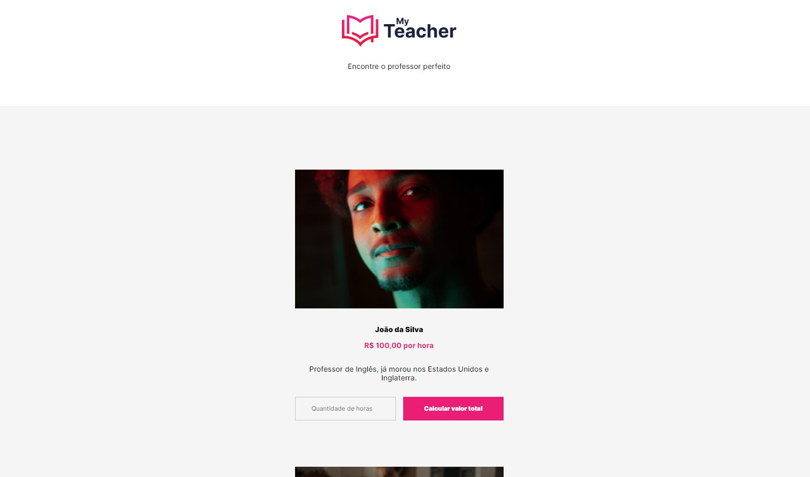

# My Teacher

> Trilha Iniciante

 Projeto desenvolvido na Semana React Python /Trilha Iniciante - Treina Web.

[🔗 Clique aqui para acessar](https://brxnodavinci.github.io/myteacher/)

## 👾 Tecnologias

- HTML
- CSS
- JavaScript

## 🐦 Contato

  <a href="mailto:brxnodavinci@gmail.com" target="_blank">
  <a href="https://www.linkedin.com/in/brxnodavinci" target="_blank">
 <a href="https://twitter.com/brxnodavinci" target="_blank">
  <a href="https://www.youtube.com/channel/UCYTueGTar0BDGKEYCyu0SCA" target="_blank">
  <a href="https://dev.to/brxnodavinci" target="_blank">

